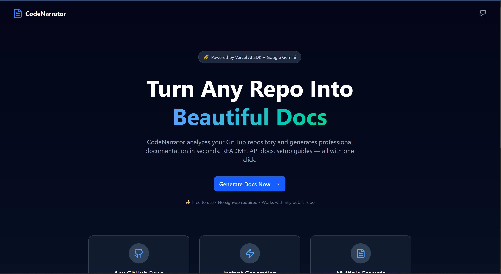
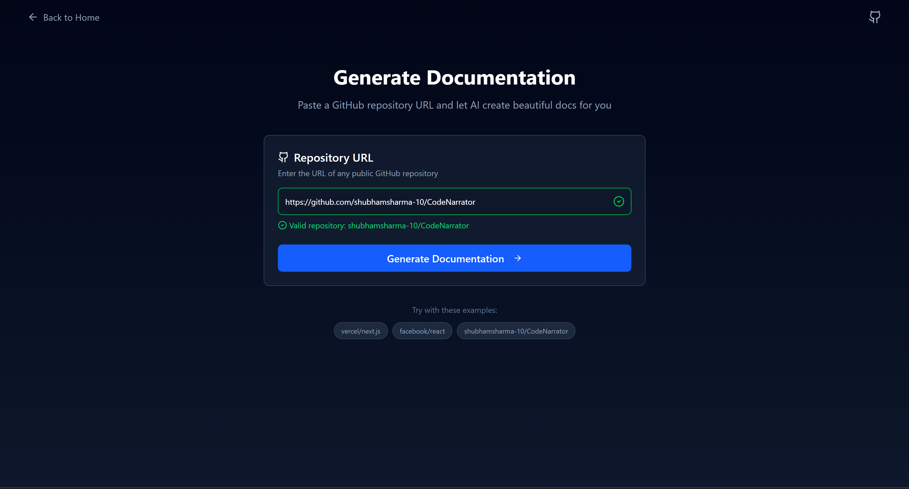
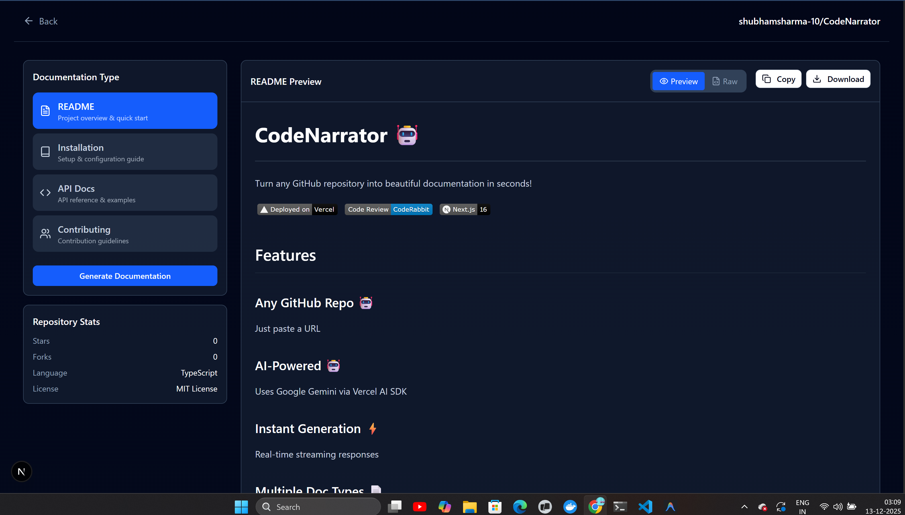
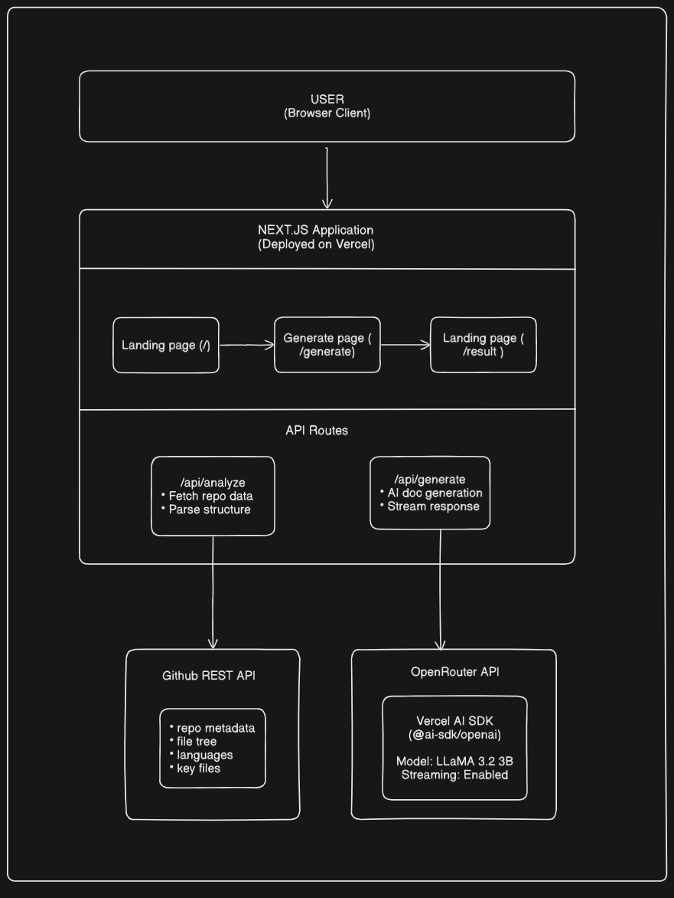
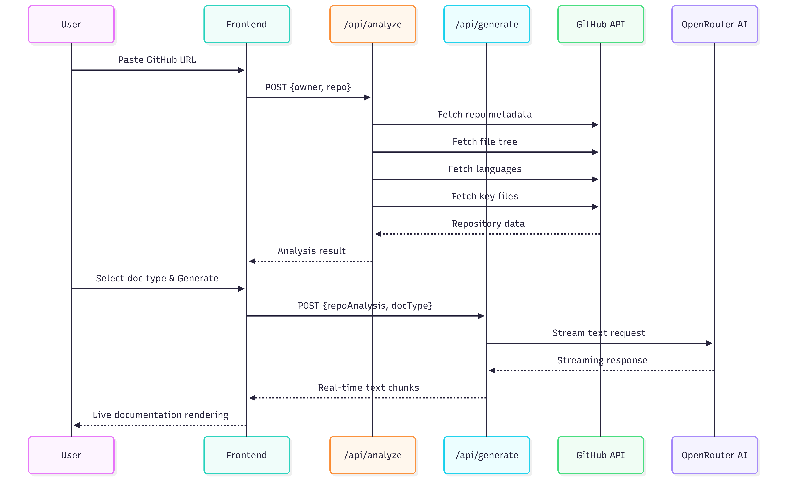
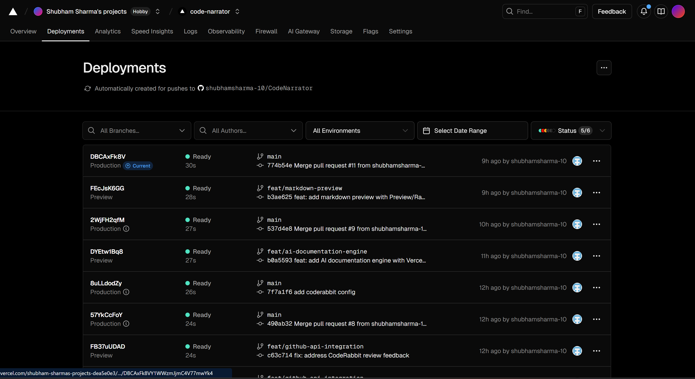
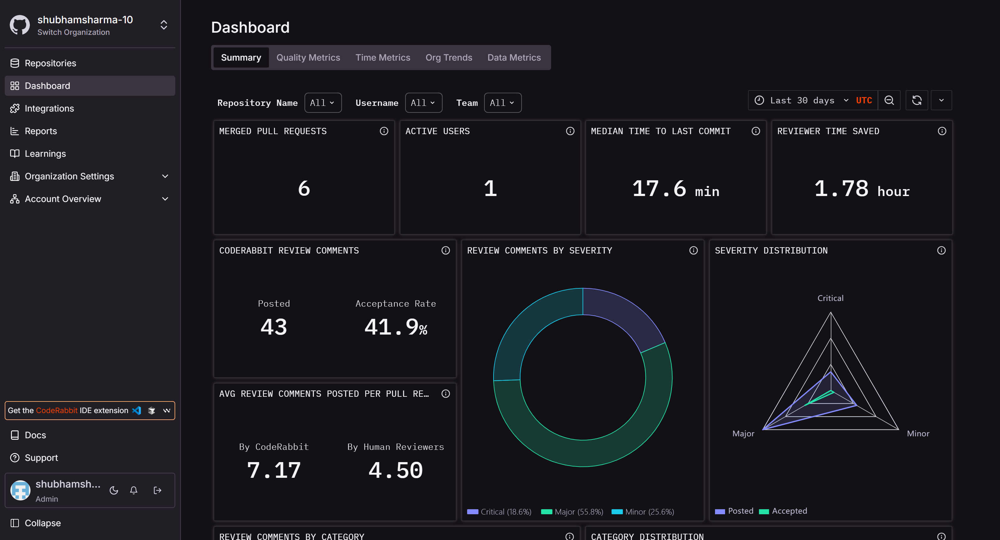

<div align="center">

# CodeNarrator

### AI-Powered Documentation Generator for GitHub Repositories

**Turn any GitHub repository into professional documentation in seconds!**


[](https://vercel.com)
[](https://sdk.vercel.ai)
[](https://coderabbit.ai)
[](https://nextjs.org)
[](LICENSE)

---

### 🏆 Built for WeMakeDevs Hackathon 2025

[Live Demo](https://code-narrator-one.vercel.app/) • [Features](#-features) • [Demo](#-demo) • [Tech Stack](#️-tech-stack) • [Architecture](#-architecture) • [Quick Start](#-quick-start)

</div>

---

## 📹 Demo

<div align="center">

[](https://youtu.be/6SFarT-fswA)

**👆 Click to watch the full demo on YouTube**

</div>

---

## 🎯 Problem Statement

### The Documentation Crisis in Software Development

**Documentation is the most neglected yet crucial part of any software project.**

| The Problem | Impact |
|-------------|--------|
| 📚 Writing docs is time-consuming | Developers skip it entirely |
| 🔄 Docs become outdated quickly | Users get confused, issues pile up |
| 😴 It's tedious and boring | Quality suffers, incomplete information |
| 🆕 New contributors struggle | Onboarding takes weeks instead of days |

### The Statistics
- **91%** of developers say good documentation is important
- Only **44%** of projects have adequate documentation
- Poor documentation costs companies **$62 billion** annually in developer time

---

## 💡 Our Solution

**CodeNarrator** uses AI to analyze your entire GitHub repository and generate professional-grade documentation instantly.

### How It Solves the Problem

| Problem | CodeNarrator Solution |
|---------|----------------------|
| Time-consuming | ⚡ Generate docs in **seconds**, not hours |
| Outdated docs | 🔄 Regenerate anytime with **one click** |
| Boring to write | 🤖 AI does the **heavy lifting** |
| Missing context | 🔍 AI analyzes **entire codebase** for accuracy |

---

## Features

### Core Features

| Feature | Description |
|---------|-------------|
| 🔗 **Universal GitHub Support** | Works with any public GitHub repository |
| 🤖 **AI-Powered Analysis** | Analyzes code structure, dependencies, languages, and patterns |
| ⚡ **Real-time Streaming** | Watch documentation generate live character by character |
| 📄 **4 Documentation Types** | README, Installation Guide, API Docs, Contributing Guide |
| 👁️ **Preview/Raw Toggle** | Switch between beautifully rendered markdown and raw code |
| 📋 **One-Click Copy** | Copy generated documentation to clipboard instantly |
| 💾 **Download as Markdown** | Export documentation as `.md` files |
| 🌙 **Dark Mode UI** | Modern, eye-friendly dark interface |

### Screenshots

<div align="center">

#### Landing Page


#### Repository Input


#### Preview Mode & Raw Mode
<p>


</p>

</div>

---

## 🛠️ Tech Stack

### Frontend

| Technology | Purpose |
|------------|---------|
| **Next.js 16** | React framework with App Router |
| **React 19** | UI library |
| **Tailwind CSS** | Utility-first CSS framework |
| **shadcn/ui** | Accessible component library |
| **Lucide Icons** | Beautiful icon set |

### AI & Backend

| Technology | Purpose |
|------------|---------|
| **Vercel AI SDK** | Streaming AI responses (`@ai-sdk/openai`) |
| **OpenRouter** | AI model gateway |
| **LLaMA 3.2** | Large language model for generation |
| **GitHub REST API** | Repository analysis and data fetching |

### DevOps & Quality

| Technology | Purpose |
|------------|---------|
| **Vercel** | Deployment and hosting |
| **CodeRabbit** | AI-powered code reviews |
| **TypeScript** | Type safety |
| **ESLint** | Code linting |

---

## Architecture

### System Overview

<div align="center">

</div>

### Data Flow

<div align="center">

</div>

---

## 🎮 How It Works

### Step-by-Step Process

#### Step 1: Paste Repository URL
Enter any public GitHub repository URL. The app validates the URL format in real-time.

#### Step 2: Repository Analysis
Our backend fetches and analyzes:
- 📊 Repository metadata (stars, forks, language, topics)
- 📁 File structure (up to 100 files)
- 🔤 Language breakdown (percentages)
- 📄 Key files content (README, package.json, etc.)

#### Step 3: Select Documentation Type
Choose from 4 documentation types:

| Type | What It Generates |
|------|-------------------|
| **README** | Project overview, features, quick start, structure |
| **Installation** | Prerequisites, step-by-step setup, troubleshooting |
| **API Docs** | Endpoints, request/response formats, examples |
| **Contributing** | How to contribute, PR process, code standards |

#### Step 4: AI Generation
The AI processes the repository context and generates documentation with:
- Real-time streaming (see text appear live)
- Proper markdown formatting
- Code examples and snippets
- Best practices included

#### Step 5: Preview & Export
- **Preview Mode:** See beautifully rendered markdown
- **Raw Mode:** View/edit the markdown source
- **Copy:** One-click clipboard copy
- **Download:** Save as `.md` file

---

## 🚀 Quick Start

### Prerequisites

| Requirement | Version |
|-------------|---------|
| Node.js | 18.0 or higher |
| npm | 9.0 or higher |
| OpenRouter API Key | [Get free key](https://openrouter.ai) |

### Installation

```bash
# 1. Clone the repository
git clone https://github.com/shubhamsharma-10/CodeNarrator.git

# 2. Navigate to project directory
cd CodeNarrator

# 3. Install dependencies
npm install

# 4. Set up environment variables
cp .env.example .env.local
```

### Environment Variables

Create a `.env.local` file with:

```env
OPENROUTER_API_KEY=your_openrouter_api_key_here

GITHUB_TOKEN=your_github_token_here
```

### Run Locally

```bash
# Start development server
npm run dev
```

Open [http://localhost:3000](http://localhost:3000) in your browser

### Build for Production

```bash
# Create production build
npm run build

# Start production server
npm start
```

---

## 📁 Project Structure

```
CodeNarrator/
├── app/                          # Next.js App Router
│   ├── api/
│   │   ├── analyze/
│   │   │   └── route.ts          # GitHub repository analysis endpoint
│   │   └── generate/
│   │       └── route.ts          # AI documentation generation with streaming
│   ├── generate/
│   │   ├── page.tsx              # Repository URL input page
│   │   └── results/
│   │       └── page.tsx          # Documentation results with Preview/Raw
│   ├── page.tsx                  # Landing page
│   ├── layout.tsx                # Root layout
│   └── globals.css               # Global styles + markdown preview CSS
│
├── components/
│   └── ui/                       # shadcn/ui components
│       ├── button.tsx
│       ├── input.tsx
│       └── tabs.tsx
│
├── lib/
│   ├── github.ts                 # GitHub API utilities
│   └── utils.ts                  # Helper functions
│
├── public/                       # Static assets
│
├── .coderabbit.yaml              # CodeRabbit configuration
├── .env.example                  # Environment variables template
├── package.json                  # Dependencies
└── README.md                     # You are here!
```

---

## 🏆 Hackathon Submission

### ⚡ Vercel Track - The Stormbreaker Deployment Award

| Requirement | Status | Evidence |
|-------------|--------|----------|
| Deployed on Vercel | ✅ | [code-narrator-one.vercel.app](https://code-narrator-one.vercel.app/) |
| Uses Vercel AI SDK | ✅ | `@ai-sdk/openai` with streaming |
| Live & Working | ✅ | Publicly accessible |


<div align="center">

</div>

### 🐰 CodeRabbit Track - The Captain Code Award

| Requirement | Status | Evidence |
|-------------|--------|----------|
| CodeRabbit Configured | ✅ | `.coderabbit.yaml` in repo |
| PR Reviews | ✅ | 6+ PRs reviewed by CodeRabbit |
| Following Suggestions | ✅ | Visible in PR history |

<div align="center">

</div>


### Pull Request History with CodeRabbit

| PR | Feature | CodeRabbit Review |
|----|---------|-------------------|
| #1 | Project Setup | ✅ Reviewed |
| #2 | GitHub URL Input | ✅ Reviewed |
| #3 | GitHub API Integration | ✅ Reviewed |
| #4 | AI Documentation Engine | ✅ Reviewed |
| #5 | Markdown Preview | ✅ Reviewed |
| #6 | UI Polish | ✅ Reviewed |

---

## 🔮 Future Roadmap

| Feature | Description | Priority |
|---------|-------------|----------|
| 🔐 Private Repos | Support for private repositories with OAuth | High |
| 📊 Multi-file Docs | Generate entire documentation suites | High |
| 🎨 Themes | Light mode and custom themes | Medium |
| 📝 Edit & Save | Edit generated docs before download | Medium |
| 📚 History | Save and revisit generated documentation | Medium |
| 🌍 i18n | Multi-language documentation generation | Low |

---

## 🤝 Contributing

We welcome contributions! Please see our [Contributing Guide](CONTRIBUTION.md).

### Quick Contribute

```bash
# Fork and clone
git clone https://github.com/shubhamsharma-10/CodeNarrator.git

# Create feature branch
git checkout -b feat/amazing-feature

# Make changes and commit
git commit -m "feat: add amazing feature"

# Push and create PR
git push origin feat/amazing-feature
```

### Code of Conduct

Please read our [Code of Conduct](CODE_OF_CONDUCT.md) before contributing.

---

## 📄 License

This project is licensed under the MIT License - see the [LICENSE](LICENSE) file for details.

---

## 🙏 Acknowledgments

- [Vercel](https://vercel.com) - For the amazing AI SDK and hosting
- [CodeRabbit](https://coderabbit.ai) - For AI-powered code reviews
- [WeMakeDevs](https://wemakedevs.org) - For organizing this hackathon
- [shadcn/ui](https://ui.shadcn.com) - For beautiful UI components
- [OpenRouter](https://openrouter.ai) - For AI model access

---

<div align="center">

### Built with ❤️ by [Shubham Sharma](https://github.com/shubhamsharma-10)

**🏆 WeMakeDevs Hackathon 2025**

---

⭐ **Star this repo** if you find it useful!
</div>